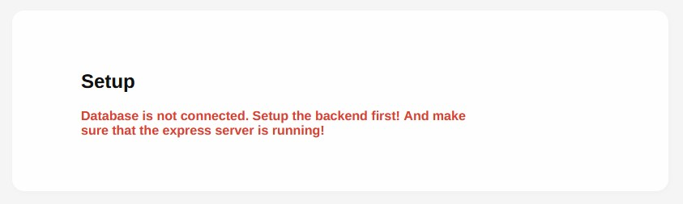

# Setup

## Prerequisites

Make sure to have the following programs installed on your system, 
before continuing with the installation.

    + nodejs v.16.0.0+
    + postgresql v.12+

## Setup - Backend

It's a [nodejs](https://nodejs.org/) based application which uses runs an [expressjs](https://expressjs.com/) webserver. The backend manages the connected [PostgeSQL](https://www.postgresql.org/) database. [GraphQL](https://graphql.org/) serves as the interface between the frontend and the backend.


### Defining environment variables

We provide a *.env.example* file that may serves as a template for your .env file, otherwise you can delete it. The .env file is responsible for your environment specific setup, like specifying the port, database address and location and their respective credentials. Your .env file should look like the following

```ini
EXPRESS_PORT=4000
DB_USER=user
DB_HOST=localhost
DB_NAME=your_database
DB_PASSWORD=password
DB_PORT=5432
JWT_SECRET=ENTER_YOUR_SECRET
MAX_SEARCH=20
```

### Create .pgpass file

The *.pgpass* file (*pgpass.conf* on windows) contains the database information which you also set in the .env file.
It's highly recommended to use a pgpass file to run the provided scripts!

To simple setup the pgpass for your system you can run the script located at `./scripts/generate_pgpass.js`

```bash
node ./scripts/generate_pgpass.js  
```

### Run Initialization

 This command will install the node modules and it will run a script that creates the database and the database structure. 

 **This script will only work with the pgpass setup correctly.**


```bash
npm run init
#Is equivalent of running:
yarn install
node scripts/setup.js
``` 


## Setup - Frontend

Install yarn (if not installed yet)

```
npm install -g yarn
```

Install the dependencies with yarn.

```bash
yarn install
# alternatively (not recommended) you may use
# npm install
```

_Note: If you need to add dependencies make sure to use: `yarn add <your_dependency>`_

### Setup Super User

Visit the setup page to setup the super user:

```bash
https://yourwebsite/setup
# For example: 
# https://localhost:8080/setup
# https://sikka-buya.de/setup
```

When you see this message, you need to make sure the backend server is running and if so, you need to setup the database first by running the setup scripts (as described above):

